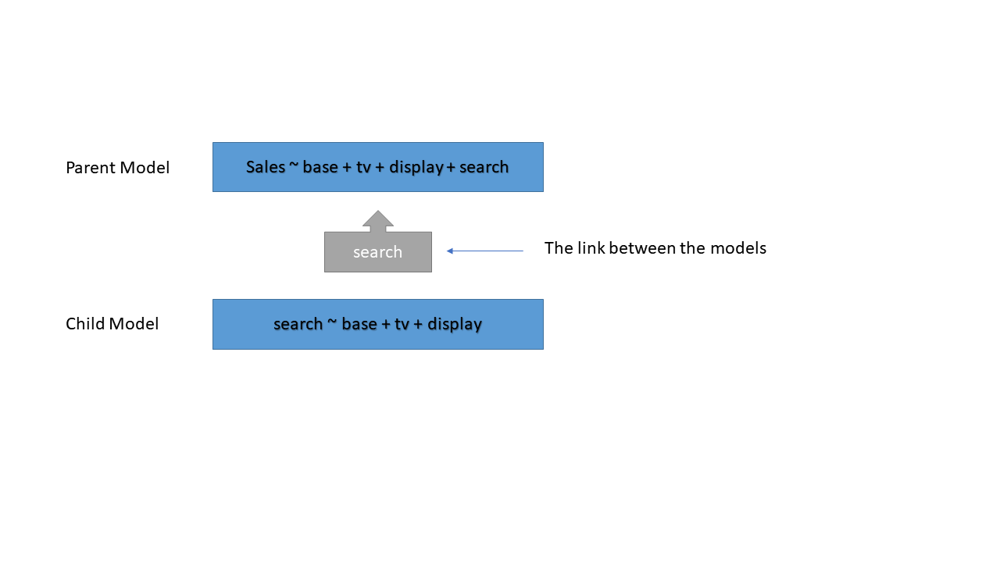

```{r setup, include=FALSE}
knitr::opts_chunk$set(echo = TRUE)
```

## Set Up Requirements

This document explains how to unnest a submodel (or child model) into a main model (parent model) in the MSMP (Marketing Science Model Platform) framework. 

First, let's define parent model and child model and how are they related. Both parent model and child model are regression models. The child model's dependent varilable is one of the independent variables in the parent model. The follow visual illustrate a parent model (sales model) and a child model (search model).

#### an example of main and sub models structure:



In this example, TV and display marketing channels can have direct effect on sales as well as indirect effect on sales through search. The purpose of the unesting process is to generate decomposition that has both direct and indirect effects. 

In this document, I am going to use this model structure to illustrate how to unnest the search model into the sales model.  In order to run unnesting function, you must have (at least) one parent model and one child model built, and their decomposition procedure done. In other words, both parent and child model objects should contain dataframe "Decomposition".

---

### UNNESTING SECTION 1: LOADING MODELS 

Before unnesting, please make sure you have the following:

  1. The parent model and child model reside in each of their whole model folder. 
  
  2. In the "output" directory of each of your model folder you need to have a .RData file which houses the model object (mod_obj). 
  
  3. Each mod_obj must have 'mod_obj\$setup', which contains the information from your "_ModelSetup.csv" file, and 'mod_obj\$Decomposition', which is decomposition dataframe.
  
  4. In the 'mod_obj\$setup' of the parent model, you need to have: 
     a) subModel1Dir : the child model's model folder name. 
     b) submodel_Link1 : the dependent variable of the child model. 

```{r Load_Nest}
library(tidyverse)
code_dir <- "C:/Users/julia.liu/OneDrive - Omnicom Media Group/Documents/MyWork/Projects/Julia/msmp/R/"
source(paste(code_dir, "unnestr2.0.R", sep = ""))

RootDirectory <- "C:/Users/julia.liu/OneDrive - Omnicom Media Group/Documents/MyWork/Projects/Julia/mmm_unnest_example/"

##### UNNESTING SECTION 1: LOADING MODELS #####
## Load environments (one for each model). They will each contain the .Rdata model object within each folder
main_mod <- load_nest(submodel_name = "main_model", root_dir = RootDirectory)
sub_mod <- load_nest(submodel_name = "sub_model", root_dir = RootDirectory)

# let's see if we have main_mod$mod_obj$Decomposition
head(main_mod$mod_obj$Decomposition)

# let's check if we have the submodel information in the setup file of the parent model
cat(main_mod$mod_obj$setup)

```


Now we are ready to call unnest function. The unnest function takes in three arguments

1.  The parent model (Object)
2.  The child model (Object)
3.  The submodel number (Integer)
    +  This comes from the "_ModelSetup.csv" file for the parent model. In that file there should be a field called **Submodel_LinkX** where **X** is the child number. The **X** number is used to keep track of multiple sub models of a parent model. 

```
main_mod$mod_obj <- unnestr(child = sub_mod$mod_obj, parent = main_mod$mod_obj, submodel_number = 1)

```


## plot the disply decomposition

```{r pressure, echo=FALSE}
plot(main_mod$mod_obj$Decomposition$Week, main_mod$mod_obj$Decomposition$d_DigitalDisplay_Impressions_t, xlab = "week", ylab="Display Decomp", type="l")

```


