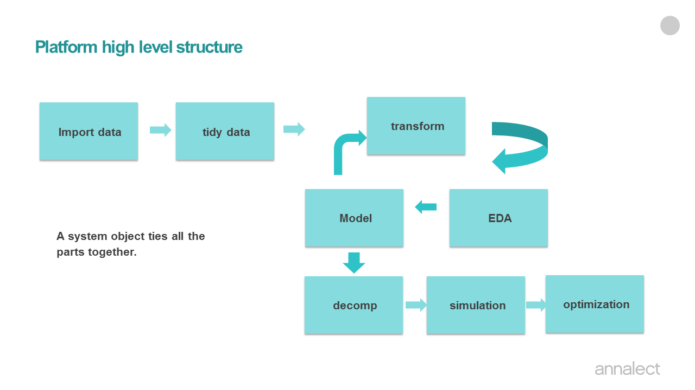

```{r setup, include=FALSE}
knitr::opts_chunk$set(echo = TRUE)
```


This R markdown is an introduction of how to build marketing mix model (MMM) model in Marketing Science Model Platform (MSMP). 

# Model framework design wishlist

1. Intuitive and straightforward;

2. Reproducible : (past/old) model results (coefficients, fit stats, decompositions, response curves, etc.) should be reproduced easily by all analysts. 

3. Flexible : 
    * can be used across different clients.
    * model refresh with new data can be easily done with minor setups. 
    * New functinality can be easily added into the existing structure of the platform.
    * backward compatible

 4. Modular :
    * The code should be written in a object-oriented way.
    * Each R function/module does on specific task. It should be written as generic as possible so that it can be easily used across different projects, and at different part of the model stage. For example, transform.R can be used pre-model stage and at the simulation stage. 

 5. It should be easy to use for users with limited R experience, but also expandible for users who are experienced in R and would like to add more functionality to the framework.
 
# High level framework structure of Marketing science Model Platform (msmp):



The model framework/code consists of eight parts, each corresponds to different stage of MMM project.  A system object (a list in the R environment) ties all the parts together. Before the project starts, the system object is an empty list. As it flows though the 8 parts, the content of the object grow. For example, after import step, the system object should contain data and spec (model specification). After run model, the model object will contain model fit stats, coefficients, and predictions. 

Even though this framework is built in R, you do not need to know much R to run MMM model in this framework. However, the framework is written in a object oriented and modular way, for a experience R user, he/she can customize and make addition to the framework according to individual customer/project need. 

# Model Process
  In this section, I will discuss the steps of building marketing mix models in msmp framework. 
  
## Model Project/folder Setup
  
  Every model has its own model folder. All model inputs as well as output files are in the model folder, with prefix of the file name be the name of the model folder name. This folder should also contain the R program that runs the model. This organization ensures any MMM result is reproducible, i.e. the past model result can be reproduced by anybody by running the R code in the model folder. 
  

## step by step instruction on creating a model project folder and its contents:

1. Create a folder (for example msmap_panel_example) that contains the model. 

2. Analyst need to create input data files for the model. There are 3 required input files: 

  1) _ModelData.csv : this is the model dataset. It should have a time variable (week or month) dependent variable and all the possible independent variables that you may need. (advertising variables, price, store promotions, distributions, brand health index, etc.). 
  For panel dataset, it should also contain a panel column. In this example, it is called "GeoCode". The panel dataset should be structured as long format and sorted by panel (GeoCode) and time (Week). 
  
  Now let's talk a little about variable naming convention. 
  + all variable names must begin with a letter of the alphabet. 
  + No spaces or special characters (such as ., &, $, %, +, or - etc.) are allowed for the variable names. For readability, you can use "_", for example, instead of "digitaldisplay", you can name the variable "digital_display". 
  + The value of the panel has to be a character, please do not use only numbers. For example, instead of using "10" as the GeoCode, please use "Geo10". 


  2) _ModelSetup.csv : this file list all the relevant specifications at the model level. model form (is it linear-linear model or log-log model), the name of the date variable in the _ModelData.csv.


  3) _Variables.csv : this file contains model specifications at the model variable level : the dependent variable, all the independent variables that are ultimately included in the model, their transformation types and transformation parameters, their priors (mean and standard deviation), etc. 

3. The R code that runs the model : run_msmp_example.R. 
   This R code goes through the whole MMM process (depicted earlier in the high level workflow) except the optimization step (which should be done in Channel Planner). Analyst can use this R code as a template, and customize any way he/she wishes. The idea of this template R code is that anybody who does not have much experience with R can start modeling right away. However, for a experienced R coder and modeler, he/she can add any customize code or procedure he/she see fits. 

The model results are generated by run_msmp_panel_example.R, and written in the "output" sub-folder. There is a set of default output files, however, users are encourage to add custom analysis code in run_msmp_panel_example.R, and write out files (excels, visuals, and etc.) that fits the needs of their client and project. 

In the rest of the sections, I will go over run_msmp_panel_example.R section by section. We will also have a deep dive into the methodology of panel model when we reach Run_Model_Panel() section of the code. 

## The flow inside run_msmp_example.R

You can think of this code as a template of running the whole MMM model process depicted in the high level view (minus the optimization portion which will be done in Channel Planner). 

### load libraries and source msmp functions. 

The following lines load the required libraries, and source the helper/utility functions. Eventually, I will build a R package out of these helper functions, so all users need to do is to load the package. 


```{r Load_MSMP}
library(car, quietly = T)
library(lmtest, quietly = T)
library(tidyverse, quietly = T)
library(lubridate, quietly = T)
library(ggplot2, quietly = T)
library(plotly, quietly = T)
library(openxlsx, quietly = T)

#Define the server : pc or mac
if (Sys.info()['sysname'] == "Darwin") {server <- "/Volumes"} else {server <- "//nyccentral"}
code_dir <- "C:/Users/julia.liu/OneDrive - OneWorkplace/Documents/MyWork/an_ms_modelplatform/msmp/R/"

source(paste(code_dir, "msmp_setup.R", sep = ""))
source(paste(code_dir, "Check_Data.R", sep = ""))
source(paste(code_dir, "Transform.R", sep = ""))
source(paste(code_dir, "Run_Model.R", sep = ""))
source(paste(code_dir, "my_bayes_v2.R", sep = ""))
source(paste(code_dir, "Decomp.R", sep = ""))
source(paste(code_dir, "decomp_summary.R", sep = ""))
source(paste(code_dir, "DueToChart.R", sep = ""))
source(paste(code_dir, "MAPE.R", sep = ""))
source(paste(code_dir, "responsecurve.R", sep = ""))
source(paste(code_dir, "unnestr3.0.R", sep = ""))
source(paste(code_dir, "abc.R", sep = ""))
source(paste(code_dir, "abc_onls.R", sep = ""))
source(paste(code_dir, "fitABC.R", sep = ""))

```

### Define model/project location
These lines define the model name and project directory. In most of the cases, the following lines are the only lines analysts need to change in the R template file. 

```{r define_path}
#######  define project directories ##############
# please edit these lines to define the path to the project folder.
ProjectName <-  "msmp_example"            # the name of the sub-folder that contains the model project
OutDir <- "output"
RootDirectory <- "C:/Users/julia.liu/OneDrive - OneWorkplace/Documents/MyWork/an_ms_modelplatform/"
ProjectDirectory <- paste(RootDirectory, ProjectName, "/", sep="")   # this is the full path of the project

```


### Import data, read in model specification files (_ModelSetup.csv, _Variable.csv). 

  Collecting MMM data can be very challenging. It involves collecting data from various stakeholders. Often time, the data comes in in various formats that need to be tidied up before merging with data from other sources. Therefore, there is usually a tremendous effort of collecting, cleaning, checking accuracy, confirming, and correcting before there is a model ready dataset for modeling. This document will not discuss this step and will assume a model-ready data file exists and this file contains all the variables (media, exogenous, and etc.)

```{r model_setup}
# define input file names
ModelDataFile <- paste(ProjectDirectory, ProjectName, "_ModelData.csv", sep="")
ModelSetupFile <- paste(ProjectDirectory, ProjectName, "_ModelSetup.csv", sep="")
ModelSpecFile <- paste(ProjectDirectory, ProjectName, "_Variables.csv", sep="")
ModelFitCurves <- paste(ProjectDirectory, ProjectName, "_Fit_Curves.csv", sep="")
# output file names
output_folder <- paste(ProjectDirectory, OutDir, sep="")
if(!file.exists(output_folder)) {
  dir.create(output_folder)
}

CoefficientsFile <- paste(output_folder,  "/", ProjectName, "_Coefficients.csv", sep="")
ActualPredictedFile <- paste(output_folder, "/", ProjectName, "_ActPred.csv", sep="")
DecompFile <- paste(output_folder,  "/", ProjectName, "_Decomp.csv", sep="")
spec_coef_vifFile <- paste(output_folder,  "/", ProjectName, "_spec_coef_vif.csv", sep="")
RCFile <- paste(output_folder,"/", ProjectName, "_ResponseCurve.csv", sep="")
kpi_spentFile <- paste(output_folder,"/", ProjectName, "_kpi_spent.csv", sep="")
ModObjectFile <- paste(output_folder, "/", ProjectName, ".RData", sep="")
ModelAllResultFile <- paste(output_folder, "/", ProjectName, "_result_workbook.xlsx", sep="")

# read input files
x <- read_csv(ModelDataFile, col_types = cols())
x$Week <- mdy(x$Week)    # changes the date format from m/dd/yyyy to yyyy/mm/dd format
Model_Spec <- read_csv(ModelSpecFile, col_types=cols())
Model_Spec <- Model_Spec %>% filter(Include == 1) # use Include to include (1)/exclude (0) variables
Model_setup <- read_csv(ModelSetupFile, col_types = cols())
# the FitCurves is an optional file.
fit_curves <- read_csv(ModelFitCurves, col_types = cols())

# Let's create some variables that are not in the raw data file
# for example 2 media variables combined, dummy variables, and etc. 
x$Year <- year(x$Week)
x$Year <- paste("Y", x$Year, sep="")
x$disp_olv_imp <- x$ONLV_IMP + x$DIS_IMP

# define model object
mod_obj <- list()    # an empty list 
mod_obj$data <- x    # ModelData file
# Variables.csv file, defines the model variables specifications
mod_obj$spec <- read_csv(ModelSpecFile, col_types=cols()) %>% 
  dplyr::filter(Include == 1) # use Include to include (1)/exclude (0) variables
# ModelSetup.csv : defines the model-level specifications
mod_obj$setup <- read_csv(ModelSetupFile, col_types = cols())
mod_obj <- msmp_setup(mod_obj)    # msmp_setup unpack the ModelSetup

```


### Data checking:

```{r data_check}
mod_obj <- Check_Data(mod_obj)

```


### Transform

  The variable level transformation specifications are defined in msmp_panel_example_Variables.csv. Please be sure to change the variable name (in Orig_Variable to Trans_Variable) if the variable is to be transformed. This is to ensure the raw variable values will not be over-written by the transformed values. If Orig_Variable == Trans_Variable when Transform=="Y", the Check_Data function will stop the run and points out the variables that needs attention. 
  
  
  The following are the types of transformations available so far:
  1. adstockv3
  
  2. log
  
  3. mc : mean-centerd
  
  4. ma : moving average. 
  
  5. adr
  

``` {r transform}
mod_obj <- Transform(mod_obj, print =F)
mod_obj$data <- mod_obj$data[mod_obj$data[[mod_obj$Time]] >= mod_obj$BeginDate & mod_obj$data[[mod_obj$Time]] <= mod_obj$EndDate,]
```

### Run Model
After variable transformation, we are ready to run the regression, to run national model, use Run_Model() function as follows:
```{r model}
print("Run model...")
mod_obj <- Run_Model(mod_obj)
```

This step adds a new component "Model" in mod_obj.
```{r model_formula}
# here is the model formula
print(mod_obj$Model$formula)
# here is model R2
print(mod_obj$Model$R2)
# MAPE
print(mod_obj$Model$MAPE)
# vif
print(mod_obj$Model$VIF)

```  

To check the model coefficients,
```{r model_coef}
knitr::kable(mod_obj$Model$coefficients)
```

To check actual vs predicted at the panel level,
```{r actpred}
ggplotly(mod_obj$Model$act_pred_chart)
```

### Decomposition
To calculate decomposition, use Decomp function.  This function adds 4 news objects in the model object (mod_obj). 

  1. Decomposition : dataframe at decomposition rolled up to national level.

  2. decomp_chart_stackedarea_origvar: a ggplot object of decomposition stacked area chart at the modeled variable level.
  
  3. decomp_chart_stackedarea : a ggplot object of decomposition stacked area chart at AggregatedVariable level.

``` {r decomp}
mod_obj <- Decomp(obj = mod_obj, incl_spent = F)
knitr::kable(head(mod_obj$Decomposition))
ggplotly(mod_obj$decomp_chart_stackedarea_origvar)
ggplotly(mod_obj$decomp_chart_stackedarea)

```

To calculate due-to, you can use function DueToChart() function as follows:
```{r dueto}
# generate due to chart
dueto <- DueToChart(df=mod_obj$Decomposition, 
                    spec = mod_obj$spec, 
                    startdate_current = mod_obj$SimStart, 
                    enddate_current = mod_obj$SimEnd, 
                    startdate_previous = mod_obj$SimStart-365,
                    enddate_previous = mod_obj$SimEnd - 365)
ggplotly(dueto$chart)
```


### Simulation

The function responsecurve_panel() does simulation and generates response curves at panel level for each variable that has "Simulate" == Y in _Variable.csv. This is how you call the function. You can set "showPlot" to TRUE to see the curve printed on screen as the function runs. It pauses at each curve, users will need to hit return for the function to move to the next variable. 

Note, it takes time to run through all the variables and panels. My suggestion is you comment this line out when you are iterating and building models. Run the responsecurve when you are done with model building. 

This function adds 2 more objects to the model object:

1. ResponseCurve_panel: a dataframe with response curves by panel and Delta. 

2. ResponseCurve : the _panel version rolled up to national level.

This plot shows the response curve for facebook impression. 

```{r responsecurve}
mod_obj <- responsecurve(obj = mod_obj, showPlot=FALSE )
knitr::kable(head(mod_obj$ResponseCurve))
plot(mod_obj$ResponseCurve$fb_total_spd, mod_obj$ResponseCurve$rc_fb_total_imp, type="l")
```

### Calculate ABC

This part is carried out by Channel Planner. 

### Optimization

This part is carried out by Channel Planner.

### The end of the code

We save the mod_obj to a Rdata file. This object contains everything you need to know about the model, and can be loaded back in R session later one by anybody to either check the model, do more simulations, or do forecasting when new data becomes available. I have written a forecasting/predict function that takes the old model object and new dataset and make prediction. It only works for national model right now, will update with a panel version soon. 

I also like to output other useful model results into a excel file to share with team members who does not use R. 

```{r the_end}
#save(mod_obj, file=ModObjectFile)

#allresultlist <- list( mod_obj$Model$coefficients,mod_obj$Model$act_pred, mod_obj$Model$result_all, #mod_obj$Decomposition)
#write.xlsx(allresultlist, ModelAllResultFile, asTable = FALSE, sheetName=c("Coefficients","Act vs Pred","Diagnostics", "Decomps"))
print("All done.")
```

## Plan for new developments

1. Decomposition for market-shared model

2. Decomposition for log-log model

3. Variable splits. For example, split total TV into TV breaks by audience, and split digital display by platforms. 


Note that the `echo = FALSE` parameter was added to the code chunk to prevent printing of the R code that generated the plot.
