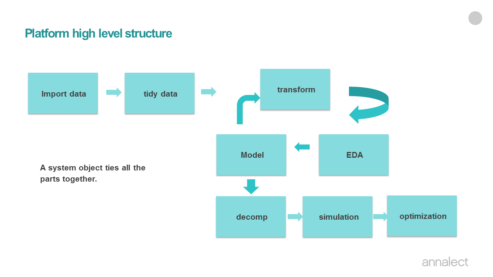

```{r setup, include=FALSE}
knitr::opts_chunk$set(echo = TRUE)
```


This R markdown is an introduction of how to build marketing mix model (MMM) panel model in Marketing Science Model Platform (MSMP). 

# What is a panel model?
A panel model is a statistical analysis using panel data. Panel data is longitudinal data where observations are for the same subject each time. 

In the context of MMM, the panel can be Nielsen Designated Market Area (DMA), which divide the US into 210 major television viewing areas, stores, or sometime can be even individuals. 

I sometime like to call panel model "multilevel model" or hierarchical model. It is also sometime called mixed-effect model or random effect model. So what is a multilevel model? I like to use Andrew Gelman's definition from his (and Jennifer Hill) book "Data Analysis using Regression and Multilevel/Hierarchical Models" : "we consider multilevel model to be a regression in which the parameters - the regression coefficients - are given a probability model. This second-level model has parameters of its own - the hyperparameters of the model - which are also estimated from data."

This definition summarizes the methodology that is implemented in Run_Model_Panel.R. But before I go into the detail of the methodology, I would first like to briefly review the MSMP model process and framework. 


# High level framework structure of Marketing science Model Platform (msmp):



The model framework/code consists of eight parts, each corresponds to different stage of MMM project.  A system object (a list in the R environment) ties all the parts together. Before the project starts, the system object is an empty list. As it flows though the 8 parts, the content of the object grow. For example, after import step, the system object should contain data and spec (model specification). After run model, the model object will contain model fit stats, coefficients, and predictions. 

Even though this framework is built in R, you do not need to know much R to run MMM model in this framework. However, the framework is written in a object oriented and modular way, for a experience R user, he/she can customize and make addition to the framework according to individual customer/project need. 


We have talked about this framework in the context of national level (non-panel/single level) model. Running a panel marketing mix model follows exactly the same work flow, the major difference is at the "Model" step. Instead of using Run_Model.R to run a national model, we will be using Run_Model_Panel.R to run a panel model. 

# Model Process
  In this section, I will discuss how to use the MSMP to build marketing mix models. 
  
## Model Project/folder Setup
  
  Every model has its own model folder. All model inputs as well as output files are in the model folder, with prefix of the file name be the name of the model folder name. This folder should also contain the R program that runs the model. This organization ensures any MMM result is reproducible, i.e. the past model result can be reproduced by anybody by running the R code in the model folder. 
  

## step by step instruction on creating a model project folder and its contents:

1. Create a folder (for example msmap_panel_example) that contains the model. 

2. Analyst need to create input data files for the model. There are 3 required input files: 

  1) _ModelData.csv : this is the model dataset. It should have a time variable (week or month) dependent variable and all the possible independent variables that you may need. (advertising variables, price, store promotions, distributions, brand health index, etc.). 
  For panel dataset, it should also contain a panel column. In this example, it is called "GeoCode". The panel dataset should be structured as long format and sorted by panel (GeoCode) and time (Week). 
  
  Now let's talk a little about variable naming convention. 
  + all variable names must begin with a letter of the alphabet. 
  + No spaces or special characters (such as ., &, $, %, +, or - etc.) are allowed for the variable names. For readability, you can use "_", for example, instead of "digitaldisplay", you can name the variable "digital_display". 
  + The value of the panel has to be a character, please do not use only numbers. For example, instead of using "10" as the GeoCode, please use "Geo10". 


  2) _ModelSetup.csv : this file list all the relevant specifications at the model level. model form (is it linear-linear model or log-log model), the name of the date variable in the _ModelData.csv.


  3) _Variables.csv : this file contains model specifications at the model variable level : the dependent variable, all the independent variables that are ultimately included in the model, their transformation types and transformation parameters, their priors (mean and standard deviation), etc. 

3. The R code that runs the model : run_msmp_panel_example.R. 
   This R code goes through the whole MMM process (depicted earlier in the high level workflow) except the optimization step (which should be done in Channel Planner). Analyst can use this R code as a template, and customize any way he/she wishes. The idea of this template R code is that anybody who does not have much experience with R can start modeling right away. However, for a experienced R coder and modeler, he/she can add any customize code or procedure he/she see fits. 

The model results are generated by run_msmp_panel_example.R, and written in the "output" sub-folder. There is a set of default output files, however, users are encourage to add custom analysis code in run_msmp_panel_example.R, and write out files (excels, visuals, and etc.) that fits the needs of their client and project. 

In the rest of the sections, I will go over run_msmp_panel_example.R section by section. We will also have a deep dive into the methodology of panel model when we reach Run_Model_Panel() section of the code. 

## The flow inside run_msmp_panel_example.R

You can think of this code as a template of running the whole MMM model process depicted in the high level view (minus the optimization portion which will be done in Channel Planner). 

### load libraries and source msmp functions. 

The following lines load the required libraries, and source the helper/utility functions. Eventually, I will build a R package out of these helper functions, so all users need to do is to load the package. 


```{r Load_MSMP}
library(car)
library(lmtest)
library(tidyverse)
library(lubridate)
library(openxlsx)
library(plotly)

#needs(data.table)
#Define the server : pc or mac
if (Sys.info()['sysname'] == "Darwin") {server <- "/Volumes"} else {server <- "//nyccentral"}
code_dir <- paste(server, "/Annalect/BrandScience/msmp/R/", sep="")

source(paste(code_dir, "msmp_setup.R", sep = ""))
source(paste(code_dir, "Check_Data.R", sep = ""))
source(paste(code_dir, "Transform.R", sep = ""))
source(paste(code_dir, "Run_Model.R", sep = ""))
source(paste(code_dir, "Gen_EB_Panel.R", sep = ""))
source(paste(code_dir, "Run_Model_Panel.R", sep = ""))
source(paste(code_dir, "my_bayes.R", sep = ""))
source(paste(code_dir, "MAPE.R", sep = ""))
source(paste(code_dir, "act_pred.R", sep = ""))
source(paste(code_dir, "scatterhist.R", sep = ""))
source(paste(code_dir, "Decomp_v2.R", sep = ""))
source(paste(code_dir, "DueToChart.R", sep = ""))
source(paste(code_dir, "responsecurve.R", sep = ""))
source(paste(code_dir, "decomp_summary_panel.R", sep = ""))


```

### Define model/project location
These lines define the model name and project directory. In most of the cases, the following lines are the only lines analysts need to change in the R template file. 

```{r define_path}
#######  define project directories ##############
# please edit these lines to define the path to the project folder.
ProjectName <-  "msmp_panel_example"            # the name of the subfolder that contains the model project
OutDir <- "output"
RootDirectory <- "//nyccentral/Annalect/BrandScience/msmp/doc/"
ProjectDirectory <- paste(RootDirectory, ProjectName, "/", sep="")   # this is the full path of the project
```

### Import data, read in model specification files (_ModelSetup.csv, _Variable.csv). 

  Collecting MMM data can be very challenging. It involves collecting data from various stakeholders. Often time, the data comes in in various formats that need to be tidied up before merging with data from other sources. Therefore, there is usually a tremendous effort of collecting, cleaning, checking accuracy, confirming, and correcting before there is a model ready dataset for modeling. This document will not discuss this step and will assume a model-ready data file exists and this file contains all the variables (media, exogenous, and etc.)

  Panel data should be structured in long format, instead of wide format, and the data should be sorted by panel by time. I will display an example later.  
```{r model_setup}
# define input file names
ModelDataFile <- paste(ProjectDirectory, ProjectName, "_ModelData.csv", sep="")
ModelSetupFile <- paste(ProjectDirectory, ProjectName, "_ModelSetup.csv", sep="")
ModelSpecFile <- paste(ProjectDirectory, ProjectName, "_Variables.csv", sep="")

# output file names
output_folder <- paste(ProjectDirectory, OutDir, sep="")
if(!file.exists(output_folder)) {
  dir.create(output_folder)
}

# these are the recommended output files. Users may add more to the list. 
PriorFile <- paste(output_folder,  "/", ProjectName, "_Priors.csv", sep="")
CoefficientsFile <- paste(output_folder,  "/", ProjectName, "_Coefficients.csv", sep="")
DecompFile <- paste(output_folder,  "/", ProjectName, "_Decomp.csv", sep="")
RCFile <- paste(output_folder,"/", ProjectName, "_ResponseCurve.csv", sep="")
kpi_spentFile <- paste(output_folder,"/", ProjectName, "_kpi_spent.csv", sep="")
ModObjectFile <- paste(output_folder, "/", ProjectName, "_ModObj.RData", sep="")
#DecompSumFile <- paste(output_folder, "/", ProjectName, "_DecompSummary.csv",  sep="")
ModelAllResultFile <- paste(output_folder, "/", ProjectName, "_result_workbook.xlsx", sep="")

# read input files
x <- read_csv(ModelDataFile, col_types = cols())

# define model object
mod_obj <- list()
mod_obj$data <- x
mod_obj$spec <- read_csv(ModelSpecFile, col_types=cols()) %>% 
  dplyr::filter(Include == 1) # use Include to include (1)/exclude (0) variables
mod_obj$setup <- read_csv(ModelSetupFile, col_types = cols())
mod_obj <- msmp_setup(mod_obj)

```
### Data checking:


```{r data_check}
mod_obj <- Check_Data(mod_obj)

```

### Transform

  Please use Transform_panel() function. The variable level transformation specifications are defined in msmp_panel_example_Variables.csv. Please be sure to change the variable name (in Orig_Variable to Trans_Variable) if the variable is to be transformed. This is to ensure the raw variable values will not be over-written by the transformed values. If Orig_Variable == Trans_Variable when Transform=="Y", the Check_Data function will stop the run and points out the variables that needs attention. 
  
  
  The following are the types of transformations available so far:
  1. adstockv3
  
  2. log
  
  3. mc : mean-centerd
  
  4. ma : moving average. 
  
  5. adr
  

``` {r transform}
mod_obj <- Transform_panel(mod_obj, print =F)
mod_obj$data <- mod_obj$data[mod_obj$data[[mod_obj$Time]] >= mod_obj$BeginDate & mod_obj$data[[mod_obj$Time]] <= mod_obj$EndDate,]
```

### Run Panel Model

To put in a simple way, you can think of multilevel modeling as a regression where intercept and some/all the slopes are allowed to vary by panel. 

There are many ways of estimating this type of model, I am going to briefly review here. For each of approach, I will also be discussing the benefit and drawbacks. 

1. category interaction model: done mainly by frequentest has done this type of model before, achieved mainly by using category interaction terms. For example, if you want OOH to be vary by GeoCode, OOH can enter the model equation as OOH:factor(GeoCode) in R equation. The benefit of this approach is that it can be carried out using OLS, run fast, and not running into "not converging" type of problems. The issue with this approach is that the data at the panel level is sparse, and the coefficients can be unreliable at the panel level. This approach also tend to result in over-fit model, which tends to result in bad forecasting. 

2. The next evolution of inference approach is something called Linear Mixed-Effects Model. This approach does not have prior distribution assumption, so you can think of it as a frequentist way to fit multilevel models. It is estimated using Restricted Maximum Likelihood (REML), and most of the popular statistical applications have implantation of this methodology: proc mixed in SAS, lmer in R, and pymer4 in python. It is used extensively by practitioners in pharmaceutical companies and some of the marketing analytic companies (Nielsen for example), and runs pretty efficient with most of my real life data. However when multilevel model is complicate (with many varying intercepts and slopes), and data at panel level is sparse,  there just might not be enough information to estimate parameters precisely, and sometime the function tend not to converge. 


3. Hierarchical Bayesian approach. 
A full bayesian treatment of multilevel model will begin with a hierarchy of priors. The model specification have a hierarchical structure, with the parameter of the within-panel regression at the bottom, controlled by the hyperparameters of the upper-level model.I have discussed this full Bayesian approach in one of my Bayesian talks at the bi-weekly, so won't get into details here. Please can consult the ppt of that talk if you are interested. To estimate or do Bayesian inference for hierarchical Bayesian model structure, you will need to do Markov Chain Monte Carlo. There are several options to do Hierarchical Bayesian model inference:

  + Rstan : you will need to learn the stan language, which is pretty neat and basically is an mathematically language to express a set of probability models. The best part of this option is that modelers can specify a model that not only estimates the model coefficients, but also estimates transformation parameters at the same time. I have not really tried this approach yet within annalect, but have known people who tried it in other companies, and have very mixed feedback so far. Mainly is around chain not converging.

  + R rhierLinearModel function in "bayesm" package. I love this R package, and learned a great deal about Bayesian statistics from it. I have used this function on real world data and on a moderate complicated model, it worked quite well, both in terms of the speed and results. 

  + rstanarm : the backend engine uses stan language, but has a lmer() like interface. Modelers who are familiar with lmer can immediate uses this function to take advantage of Bayesian inference. I had really high hope for this solution, however, I have tried it (stan_glmer in particular) on several models, and it either takes really long timer or does not converge. One model I tried was with 3 independent variable (intercept included), 88 panels, intercept randomized. It did not converge. I have also tried rstanarm using this dataset, a toned down version with only 3 randomized terms, it took about 3.5 hours on my laptop to run : 

eq <- as.formula(KPI_t ~ seasonality_t + base_price_t + acv_distribution_t + price_discount_t + feature_t + display_t + feature_display_t + video_t + audio_t + digital_display_t + search_t + OOH_t + PR_t + samples_t + (1+ feature_t+ OOH_t  |GeoCode))
Sys.time()
fit <- stan_lmer(eq, data=mod_obj$data)
Sys.time()
 
This model only has 10 panels and 3 randomized terms, and we would like a solution that can handel potentially 210 DMAs and 10 randomized terms. I am not sure this solution will handle it. I will love to connect with other colleagues who had more positive experience with rstanarm. 


4. Given the reality, we need to develope a solution that's practical, runs efficiently, and can scale to complex multilevel models that allows varied coefficients by geo locations while still giving modelers some control to regulize unreliable coefficients for panels that has sparse data. To meet these needs, I have developed a 2-steps approach and this approach is implemented in Run_Model_Panel.R.  On a very high level, this function first calculates/data mine the priors from a model result that does not have prior influence. Then it run the final Bayesian regression using the priors. Here is how you run the function:

```{r model}
print("Calculate Empirical Bayesian Priors:")
eb_priors <- Gen_EB_Panel(mod_obj)
print("Run hierarchical bayesian model using the emperical priors:")
mod_obj <- Run_Model_Panel(obj=mod_obj, priors=eb_priors)

```

The Run_Model_Panel function consists of 3 steps:

1. run a interaction model with un-informative priors (0 mean with big standard errors). The interaction terms are the terms you would like to randomize. Here is how the regression equation/formula specified for this example. 

```{r model_formula}
print(mod_obj$Model$formula)

```  

All the variables that have "VaryBy" (in _Variables.csv) == "GeoCode" have interactions terms. The "Estimate", "Error", "Tvalue" of the following dataframe shows the result of this interaction term model, the "VaryBy" variables have different coefficients by GeoCode.


```{r model_prior}
knitr::kable(mod_obj$Model$Priors)
```

  2. In step two, the code calculates priors based on the interaction model result - "Estimate", and put the priors in "Prior_Mean" and "Prior_SD". Here is how the code calculates the priors: 
   Prior_Mean = average of the estimates that have the expected sign. The code knows whether the estimate has the expected sign or not based on the "Sign" column in the _Variale.csv file: 1 means positive, -1 means negative, 0 means no expectations. 
   Prior_SD = Prior_Mean * PriorSD_Adj.
   The default value of PriorSD_Adj is 1, and modelers can adjust it by variable. The smaller the PriorSD_Adj, the more the final posterior estimate by GeoCode shrinks towards the Prior_Mean. 
   
   Several notes here:
  
      - What if the expected sign is, say, positive, and there are no postive coefficents from the 1st step? The Run_Model_Panel gives a diffuse prior for that variable. 
      
      - In cases described in above, the user may override the diffuse value with an (informative) prior, which can comes from previous model or another analysis. To do that, you will need to turn "Override" to "Y". 
      
      - You can use the "Override" feature to override the prior estimate from the first step. 
   
   It is a good practice to check the dataframe "Priors" to make sure the algorithm populates the priors correctly. 
   
  3. In step three, the code runs the final (interaction) model with the priors calculated from step two. To see the final coefficients by panel:
   
```{r model_coef}
knitr::kable(mod_obj$Model$coefficients)
```

You can use function scatterhist() to check how the final bayesian esiimates compared to the interaction model in step 1. For example,  

#```{r model_scatterhist}
#with(mod_obj$Model$freq_priors_bayes[mod_obj$Model$freq_priors_bayes$Variable=="digital_display_t", ], scatterhist(estimate_freq, estimate_bayes, xlab="frequentist", ylab="Emperical Bayes"))
#```

 To check actual vs predicted at the panel level,
```{r actpred_dma}
ggplotly(mod_obj$Model$act_pred_dma_chart[[1]])
ggplotly(mod_obj$Model$act_pred_dma_chart[[2]])
```
 The Run_Model_Panel also creates a national/aggregated view of the actual vs predicted view
```{r actpred_nat}
ggplotly(mod_obj$Model$act_pred_chart)

```

A few summary points about the methodology implemented by Run_Model_Panel:

1. Run_Model_Panel implements a heuristics way to estimate the multilevel/panel model. It first estimates/learns the hyperparameters of the distribution of the randomized coefficients from a model in step one, that empirical learning enters a final Bayesian model as priors.  It by-passes Markov Chain Monte Carlo, so it runs fast and can scale to complicated model without running into "chain not converging issues". I have tested out on a DMA level model (210 DMAs) with as many as 15 randomized independent variables, it ran without any issues. 

2. This approach only works for aggregated data/model, where the model error can be approximated to be normally distributed. It does not apply to individual level data/model. 


### Decomposition
To decomposition of the panel model, you use the Decomp(). This function adds 4 news objects into the model object (mod_obj). 
  1. Decomposition_panel : dataframe of decomposition at panel and time level.

  2. Decomposition : dataframe at decomposition rolled up to national level.

  3. decomp_chart_stackedarea_origvar: a ggplot object of decomposition stacked area chart at the modeled variable level.
  
  4. decomp_chart_stackedarea : a ggplot object of decomposition stacked area chart at AggregatedVariable level.

To calculate due-to, you can use function DueToChart() function. 

``` {r decomp}
mod_obj <- Decomp(obj = mod_obj, incl_spent = F)
knitr::kable(head(mod_obj$Decomposition_panel))
knitr::kable(head(mod_obj$Decomposition))
ggplotly(mod_obj$decomp_chart_stackedarea_origvar)
ggplotly(mod_obj$decomp_chart_stackedarea)

```


### Simulation

The function responsecurve_panel() does simulation and generates response curves at panel level for each variable that has "Simulate" == Y in _Variable.csv. This is how you call the function. You can set "showPlot" to TRUE to see the curve printed on screen as the function runs. It pauses at each curve, users will need to hit return for the function to move to the next variable. 

Note, it takes time to run through all the variables and panels. My suggestion is you comment this line out when you are iterating and building models. Run the responsecurve when you are done with model building. 

This function adds 2 more objects to the model object:

1. ResponseCurve_panel: a dataframe with response curves by panel and Delta. 

2. ResponseCurve : the _panel version rolled up to national level.

This plot shows the response curve for video. 

```{r responsecurve}
mod_obj <- responsecurve_panel(obj = mod_obj, showPlot=FALSE )
knitr::kable(head(mod_obj$ResponseCurve_panel))
plot(mod_obj$ResponseCurve$Delta, mod_obj$ResponseCurve$rc_video, pch=20)
```

### Calculate ABC

This part is carried out by Channel Planner. 

### Optimization

This part is carried out by Channel Planner.

### The end of the code

We save the mod_obj to a Rdata file. This object contains everything you need to know about the model, and can be loaded back in R session later one by anybody to either check the model, do more simulations, or do forecasting when new data becomes available. I have written a forecasting/predict function that takes the old model object and new dataset and make prediction. It only works for national model right now, will update with a panel version soon. 

I also like to output other useful model results into a excel file to share with team members who does not use R. 

```{r the_end}
save(mod_obj, file=ModObjectFile)

allresultlist <- list(mod_obj$Model$Priors, mod_obj$Model$coefficients,mod_obj$Model$act_pred, mod_obj$Model$result_all, mod_obj$Decomposition_panel, mod_obj$Decomposition)
write.xlsx(allresultlist, ModelAllResultFile, asTable = FALSE, sheetName=c("Priors", "Coefficients","Act vs Pred","Diagnostics","Decomps_panel", "Decomps_national"), overwrite = T)
print("All done.")
```

## Plan for new developments

1. Decomposition for log-log model

2. Variable splits. For example, split total TV into TV breaks by audience, and split digital display by platforms. 


Note that the `echo = FALSE` parameter was added to the code chunk to prevent printing of the R code that generated the plot.
